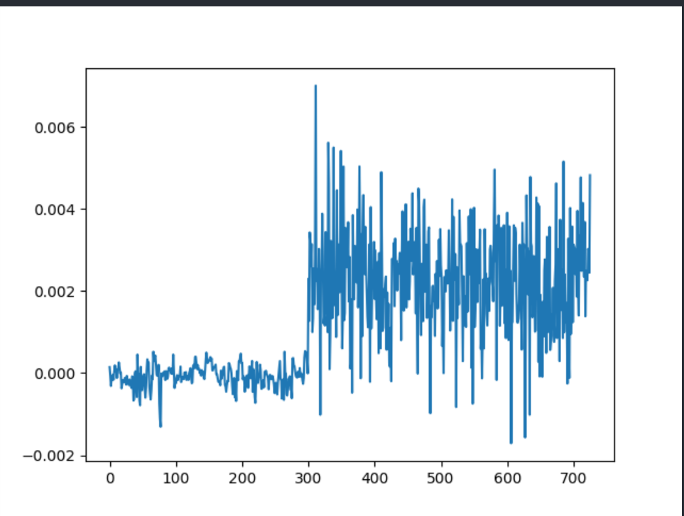
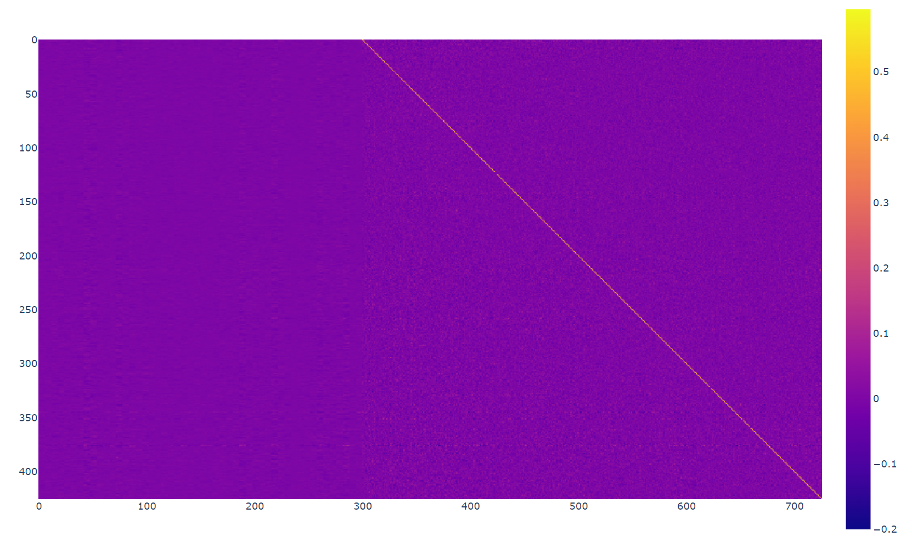

# Report-01

## Abstract
Experimenting the baseline and some basic feature engineering techniques.

## Experiments Docs:
- **Baseline** with L-Regression (sklearn's):
  - 7.54 MSE on val-set, 5.34 on train-set. 
  - Same with different model for each blood-vessel (as mathematically expected)
  - Window Sizes: Best unified window sizes found out to be -
    - neuro_back, neuro_for, vascu_back = (5,2,1)
  - Ablation Studies - Dropping a windows:
    - Dropping vascular-window: 13.08MSE on val-set, 11.66MSE on train-set.
    - Dropping neuro-forward-window: 7.54 MSE on val-set, 5.34 on train-set. 
    - Dropping neuro-backward-window: 7.58 MSE on val-set, 5.36 on train-set.
- **Control Groups:** (tested on Baseline with tuned hparams)
  - Randomizing the actual dataset (Lior's Suggestion): 13.94MSE on val-set, 14.08MSE on train-set.
  - Persistence Model - naively Predicting previous vascular activity: 6.132MSE on val-set, 7.38MSE on train-set
    - Explanation: This is not auto-regression, so the model strongly relies on the *golden* vascular activity.
    - Lesson: Avoid using 'forced learning' as we do here.
  - Combining the above two: 27.63MSE on val-set, 28.03 on train-set.
- **Neural Networks:**  
  - LinearRegression {LR: 3e-4, W-Decay: 1e-4, Window-sizes: (4,2,1)}: 7.489MSE on val-set, 5.357 on train-set.
  - Probing the weights (first 300 are neuronal windows, the last 426 is vascular window):
    
    
- **Future:**
  - **More work on L-Regression**:
    - on feature engineering (turning `y` to a future window we need to predict) and tuning window size.
    - Scale/ Normalize the dataset (neuronal and vascular activities are in different 'units').
  - **Neural Network**:
    - Aggregating each window-type separately with different layer.
    - Simple and residual based model: add a neuronal-residual based on the blood.
    - Try predicting batch (say 5) of time stamps, rather than 1.
    - RNN (auto-regressive) (e.g. LSTM).
      - Cute ref: https://www.tensorflow.org/tutorials/structured_data/time_series
      - https://curiousily.com/posts/time-series-forecasting-with-lstm-for-daily-coronavirus-cases/
      - Convolutional Settings
        - Treat each `X` 2D array with 3 channels - vascular past, neuronal past, neuronal future
  - **Random Forest Regressors**:
    - Try utilizing XGBoost Regressor.
